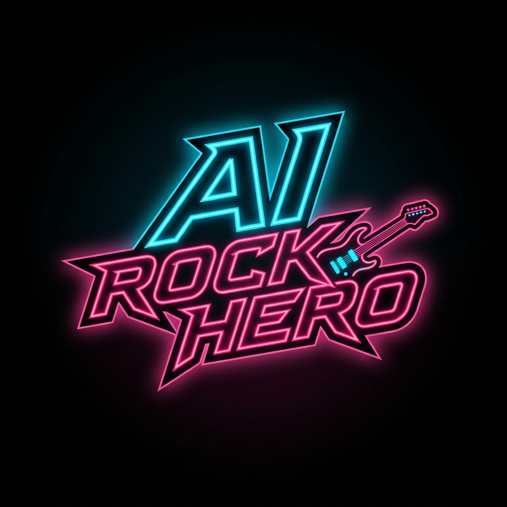

<div align="center">



# AI Rock Hero

**A browser-based rhythm game that turns any song into a playable Guitar Hero chart — powered by AI beat detection, real-time 3D rendering, and Web3 wallet integration.**

[](https://www.typescriptlang.org/)
[](https://react.dev/)
[](https://threejs.org/)
[](https://vitejs.dev/)
[](https://tailwindcss.com/)

[Play Now](#) · [Architecture](#architecture) · [Tech Stack](#tech-stack) · [Contributing](#contributing)

</div>

---

## Overview

AI Guitar Hero is a production-grade rhythm game that runs entirely in the browser. Paste a YouTube URL or upload an audio file — the AI engine analyzes it, generates a note chart, and drops you into a fully rendered 3D concert stage in seconds. Professional MIDI charts are also supported.

### Key highlights

- **AI-powered chart generation** — Adaptive beat detection converts any audio source into a playable note chart with no manual charting required.
- **Professional-grade 3D highway** — Built with Three.js and React Three Fiber: chrome dome fret pads, a mirror-finish reflective floor, dynamic spotlights, and a camera that zooms in as your combo grows.
- **Zero-install** — Pure browser app. No plugins, no downloads, no accounts required.
- **Web3 leaderboard** — Connect an Ethereum-compatible wallet via RainbowKit to submit scores to a global leaderboard.
- **Full accessibility suite** — Colorblind mode with per-lane geometric shapes, reduced motion toggle, adjustable note speed, and latency auto-calibration.
- **Graceful degradation** — Remains fully playable when external APIs (YouTube extractor, blockchain) are unavailable, with synthesized fallback audio.

---

## Gameplay

### Controls

| Key | Action |
|-----|--------|
| `1` `2` `3` `4` | Hit lane 1–4 |
| `Enter` / `Space` | Strum |
| `P` / `Esc` | Pause / Resume |

Touch controls are fully supported on mobile via invisible 4-lane tap zones and a strum bar button.

### Scoring

| Hit quality | Timing window | Points |
|-------------|--------------|--------|
| **PERFECT** | ±30 ms | 150 × multiplier |
| **GREAT** | ±60 ms | 100 × multiplier |
| **GOOD** | ±90 ms | 50 × multiplier |
| **MISS** | > 120 ms | 0 (rock meter −10) |

**Combo multiplier** steps up at 10, 25, and 50 consecutive hits (max 4×).

**Rock Meter** starts at 50 %. It drains on misses and charges with hits. Reaching 0 % ends the run.

**Grades:** S ≥ 95 % · A ≥ 80 % · B ≥ 65 % · C ≥ 50 % · D < 50 %

### Song sources

| Source | How |
|--------|-----|
| YouTube | Paste any URL — audio is extracted via Cobalt API proxy |
| Local file | Upload MP3, WAV, OGG, or any browser-supported format |
| MIDI chart | Load a `.mid` file for a professionally authored chart |
| Built-in | Slipknot — *Duality* ships with a full Expert-difficulty MIDI chart |

---

## Architecture

```
src/
├── main.tsx                  # App entry — Wagmi/RainbowKit providers
├── App.tsx                   # Tab router & shell
├── store.ts                  # Zustand stores (ephemeral + persisted)
│
├── components/
│   ├── PlayTab.tsx           # Core gameplay (~1 430 lines)
│   ├── SongsTab.tsx          # Song library browser
│   ├── StatsTab.tsx          # Lifetime stats dashboard
│   ├── SettingsTab.tsx       # Audio, display & accessibility settings
│   ├── WalletTab.tsx         # Web3 wallet & leaderboard
│   └── Navigation.tsx        # Tab bar
│
├── lib/
│   ├── songStorage.ts        # IndexedDB read/write for songs & charts
│   └── midiLoader.ts         # MIDI parser → note array
│
├── ParticleSystem.tsx        # 2D canvas particle bursts on hit
└── ConcertBackground.tsx     # Procedural animated concert backdrop

public/
└── songs/duality/
    ├── song.mp3              # Slipknot — Duality
    └── notes.mid             # Pro chart (Expert difficulty)
```

### Data flow

```
Audio source (YouTube / local file / MIDI)
        │
        ▼
  Beat Detection Engine
  (50 ms energy windows, adaptive threshold 1.6×)
        │
        ▼
  Note Chart  ─────────────────────────────────────────────────┐
        │                                                       │
        ▼                                                       ▼
  Game Loop (60 FPS, requestAnimationFrame)          IndexedDB (songStorage)
  ├── Three.js scene (notes, highway, lights)        Persisted across sessions
  ├── Hit Detection (±30/60/90/120 ms windows)
  ├── Score / Combo / Rock Meter update
  └── 10 Hz UI sync → Zustand → React HUD
```

### State management

| Store | Persistence | Contents |
|-------|-------------|---------|
| `useGameStore` | In-memory | Score, combo, multiplier, accuracy, hit flashes, rock meter, playback time |
| `usePersistedStore` | `localStorage` | Settings, lifetime stats, last 50 sessions, saved songs with high scores |
| Song audio & charts | `IndexedDB` | Binary audio buffers and generated charts (no size limit) |

---

## Tech Stack

### Core

| Layer | Technology | Version |
|-------|-----------|---------|
| Language | TypeScript | 6.0 |
| Framework | React | 19.2 |
| Build tool | Vite | 8.0 |
| Styling | Tailwind CSS | 4.3 |
| Animations | Framer Motion | 12.38 |
| State | Zustand | 5.0 |
| Icons | Lucide React | 1.16 |

### 3D Rendering

| Library | Version | Role |
|---------|---------|------|
| Three.js | 0.184 | WebGL scene, materials, lights, shadows |
| React Three Fiber | 9.6 | Declarative Three.js in React |
| React Three Drei | 10.7 | Scene helpers: `RoundedBox`, `Sparkles`, `Box`, `Plane`, etc. |

### Audio & AI

| Library | Role |
|---------|------|
| Web Audio API | PCM decoding, playback, precise timing |
| Tone.js 15.1 | Web Audio abstraction layer |
| @tonejs/midi 2.0 | MIDI file parsing |
| Meyda 5.6 | Audio feature extraction |
| Cobalt API | YouTube audio extraction (Vite proxy) |

### Web3

| Library | Version | Role |
|---------|---------|------|
| wagmi | 2.19 | Ethereum React hooks |
| viem | 2.49 | Low-level EVM client |
| RainbowKit | 2.2 | Wallet connection UI |

---

## Beat Detection Algorithm

The AI chart generator runs entirely in the browser with no server-side ML model:

```
1. Decode audio → PCM float samples  (Web Audio API — AudioContext.decodeAudioData)
2. Slice into 50 ms energy windows   (10-sample step for overlapping analysis)
3. Compute RMS energy per window
4. Build adaptive threshold          (mean of last 20 windows × 1.6)
5. Mark window as a beat if energy > threshold
6. Enforce minimum 180 ms gap        (prevents double-triggering on transients)
7. Distribute beats across 4 lanes   (varied patterns for playability)
8. Fallback: procedural chart        (if detected beats < song_duration / 2)
```

This approach handles the full dynamic range of genres — from dense metal to sparse ballads — with no pre-trained model or external API call.

---

## 3D Scene Details

### Highway

- **Floor** — Dark mirror material: `metalness: 0.995`, `roughness: 0.0`, `reflectivity: 1.0`
- **Lanes** — 4 colored emissive strips (green, red, yellow, blue)
- **Fret markers** — Horizontal beat lines for the fretboard effect
- **Camera** — Starts at `[0, 4.2, 6]`; Z-axis lerps inward as combo grows (`6 - min(combo × 0.012, 1.8)`)

### Fret pad buttons

Each pad is built from 8 stacked meshes for a realistic chrome dome appearance:

```
hollow base ring
  → chrome outer rim  (emissive, highly metallic)
    → accent halo
      → inner glow circle
        → raised hemisphere dome
          → dome inner rim
            → dual specular highlights (bright white spots)
              → floor glow circle
```

Point light intensity spikes on button press for tactile visual feedback.

### Lighting rig

| Light | Color | Purpose |
|-------|-------|---------|
| AmbientLight | White, 0.08 | Global fill |
| PointLight | White | Overhead key |
| SpotLight × 3 | Pink / Blue / Purple | Stage wash |
| PointLight × 2 | Yellow / Green | Lane accent |

### Note objects

- 4-sided colored gems with metallic finish and specular edge glow
- **Colorblind mode** renders distinct shapes per lane: cylinder, box, cone, cube
- Shadow discs beneath notes for depth
- Pulsing animation driven by a sine wave each frame

---

## Accessibility

| Feature | Description |
|---------|-------------|
| Colorblind mode | Per-lane geometric shapes instead of color-only differentiation |
| Reduced motion | Disables non-essential animations |
| Note speed | 4 levels (Slow → Ludicrous) |
| Latency calibration | ±200 ms manual offset + audio auto-detect test |
| Fullscreen | Native browser Fullscreen API |
| Mobile | Invisible 4-lane touch zones + strum bar |

---

## Getting Started

```bash
# Clone
git clone https://github.com/harleysederholm-alt/aihero.git
cd aihero

# Install dependencies
npm install

# Start dev server (Cobalt API proxy included)
npm run dev

# Production build
npm run build
```

Requires Node 20+. No environment variables are needed for local development — the Cobalt proxy is configured automatically in `vite.config.ts`.

---

## Key Files Reference

| File | Lines | Role |
|------|-------|------|
| `src/components/PlayTab.tsx` | ~1 430 | Game loop, 3D scene, hit detection, HUD, audio |
| `src/store.ts` | ~262 | All Zustand stores |
| `src/lib/songStorage.ts` | ~97 | IndexedDB CRUD for songs and charts |
| `src/lib/midiLoader.ts` | ~57 | MIDI → note array parser |
| `src/ParticleSystem.tsx` | ~141 | Canvas particle effects |
| `src/ConcertBackground.tsx` | ~150 | Procedural concert backdrop |
| `vite.config.ts` | — | Vite config + Cobalt API proxy |

---

## Contributing

Pull requests are welcome. For significant changes, open an issue first to discuss the approach.

```bash
npm run lint      # ESLint
npm run build     # Type-check + production bundle
```

---

## License

MIT © 2025 Harley Sederholm
